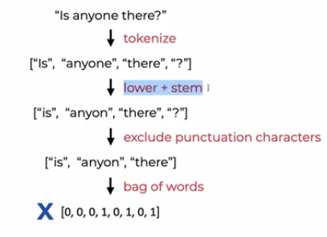
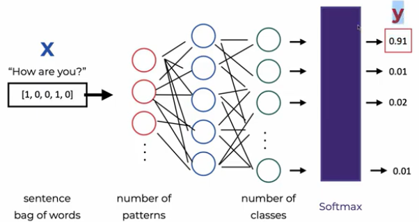
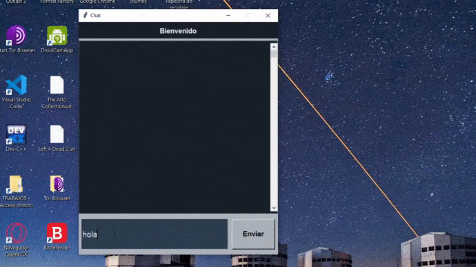

<h2 align="center">
<p>Chatbot with PyTorch 🤖</p>
</h2>

<p align="center"> 

</p>

## 📖 Preproccesing
Much of this work was inspired by [this](https://youtu.be/RNEcewpVZUQ) tutorials. For the preprocessing of the training text, the techniques of tokenization, bag of words and steeming have been used. The input to the network will be a vector with 0's and 1's (product of preprocessing).

<p align="center">
  
  <p align="center">Pipeline of the preproccesing</p>
</p>

## 🧠 Model
The architecture used was a feedforward network (very simple). The network receives a input vector (length equal to size of bag of words). Subsequently, it shows the user a random response (from the json file) based on that category.

Part of the network code is shown below.

```python
class Net(nn.Module):
    def __init__(self, input_size, hidden_size, output_size):
        super(Net, self).__init__()
        self.linear1 = nn.Linear(input_size, hidden_size)
        self.linear2 = nn.Linear(hidden_size, hidden_size)
        self.linear3 = nn.Linear(hidden_size, output_size)
        self.relu = nn.ReLU()

    def forward(self, x):
        x = self.relu(self.linear1(x))
        x = self.relu(self.linear2(x))
        output = self.linear3(x)
        return output
```

<p align="center">
  
  <p align="center">Architecture of the neural network</p>
</p>

For train the network, run:
```console
python train.py
```
## Customize ⚙️

The training dataset used is in the [intents.json](intents.json) file, which contains texts in Spanish that will serve as quick responses from our chatbot (A tokenizer and steemer focused on the Spanish language must be used). If you want the chatbot to have more elaborate responses, you can expand the categories and quick responses. Just define a new `tag`, possible `patterns`, and possible `responses` for the chat bot. You have to re-run the training whenever this file is modified.
```console
{
    "intents": [
      {
        "tag": "saludo",
        "patterns": [
          "Hola",
          "Qué tal?",
          "Hay alguien allí?",
          "Buenos dias",
          "Buen dia"
        ],
        "responses": [
          "Hola :^)",
          "Hola, gracias por la visita",
          "Hola, qué puedo hacer por ti?",
          "Hola, cómo puedo ayudarte?"
        ]
      },
      {
        "tag": "despedida",
        "patterns": ["Adiós", "Nos vemos luego", "Hasta la próxima"],
        "responses": [
          "Hasta luego, gracias por tu visita",
          "Ten un buen dia",
          "Chau, espero verte de nuevo."
        ]
      },
    ...
  ]
}
```

## ▶ Demo

If you want to run application, simply install all the dependencies of the *requirements.txt* and execute the following line.

```bash
python app.py
```

One windows will open immediately, as shown below.

<p align="center">
  
</p>

## 👨‍💻 Maintainers
* Cristhian Wiki, Github: [HiroForYou](https://github.com/HiroForYou) Email: csanchezs@uni.pe